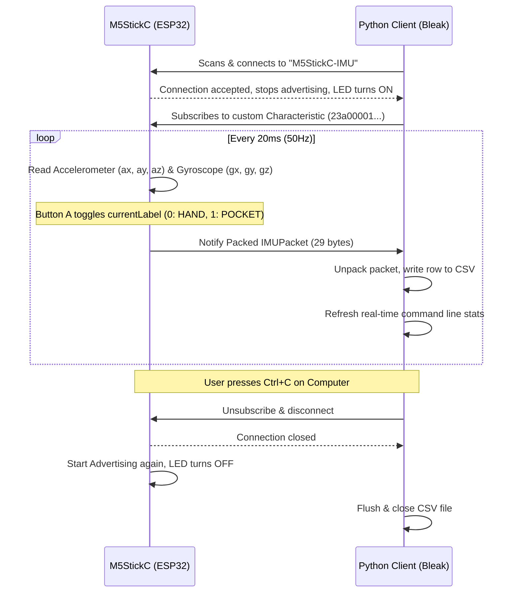

# M5StickC IMU BLE Data Streamer and Logger (M5Unified Version)

This project enables real-time streaming of IMU (accelerometer + gyroscope) data from an **M5Stack M5StickC series** device (M5StickC, M5StickC Plus, or M5StickC Plus2) to a computer over **Bluetooth Low Energy (BLE)**. It uses C++ (`M5Unified` + `M5GFX`) for the device firmware and Python (`Bleak`) for the data receiver.

The repo is now standardized on **Python 3.12** via [.python-version](file:///Users/rarora/dev/imu_tests/.python-version), and the top-level [requirements.txt](file:///Users/rarora/dev/imu_tests/requirements.txt) includes the training, BLE client, and TensorFlow Lite conversion stack.

The primary objective is to collect annotated training data for a PyTorch Machine Learning model. Specifically, it allows you to press a button on the M5StickC to toggle between two activity classes:
1. **Walking with the device in hand** (Label: `0`)
2. **Walking with the device in pocket** (Label: `1`)

---

## Repository Structure

- [firmware/m5stickc_imu_ble/m5stickc_imu_ble.ino](file:///Users/rarora/dev/imu_tests/firmware/m5stickc_imu_ble/m5stickc_imu_ble.ino): Arduino IDE sketch containing the firmware.
- [client/requirements.txt](file:///Users/rarora/dev/imu_tests/client/requirements.txt): Python dependency file.
- [client/collect_data.py](file:///Users/rarora/dev/imu_tests/client/collect_data.py): Python script that connects via BLE, parses binary packages, logs to CSV, and supports an offline simulation (mock) mode.

---

## How It Works



### 1. BLE Data Packet Protocol
Data packets are streamed using a highly efficient packed binary format to ensure low latency and low power consumption on the BLE channel. Both the ESP32 and Python code agree on the [IMUPacket](file:///Users/rarora/dev/imu_tests/firmware/m5stickc_imu_ble/m5stickc_imu_ble.ino#L38-L47) binary structure layout:

| Field | C++ Type | Python Type | Size (Bytes) | Description |
|---|---|---|---|---|
| `timestamp` | `uint32_t` | `unsigned int` (I) | 4 | Device runtime timestamp in milliseconds |
| `ax` | `float` | `float` (f) | 4 | Accelerometer X value in units of g |
| `ay` | `float` | `float` (f) | 4 | Accelerometer Y value in units of g |
| `az` | `float` | `float` (f) | 4 | Accelerometer Z value in units of g |
| `gx` | `float` | `float` (f) | 4 | Gyroscope X value in degrees/second |
| `gy` | `float` | `float` (f) | 4 | Gyroscope Y value in degrees/second |
| `gz` | `float` | `float` (f) | 4 | Gyroscope Z value in degrees/second |
| `label` | `uint8_t` | `unsigned char` (B) | 1 | Activity label: `0` (Hand) or `1` (Pocket) |
| **Total Size** | | | **29 bytes** | |

The binary unpacking is executed in Python by the [parse_packet](file:///Users/rarora/dev/imu_tests/client/collect_data.py#L24-L38) function using the format string `<IffffffB` (little-endian).

---

## Getting Started: Embedded Firmware (Arduino IDE)

1. Install the Arduino IDE (version 2.x or later is recommended).
2. Install ESP32 Board Support:
   - Open **Preferences** in the Arduino IDE.
   - Under **Additional Boards Manager URLs**, add: `https://raw.githubusercontent.com/espressif/arduino-esp32/gh-pages/package_esp32_index.json`
   - Go to **Boards Manager** (left sidebar), search for `esp32` by Espressif, and click **Install**.
3. Install **M5Unified** and **M5GFX** Libraries:
   - Go to **Library Manager** (left sidebar).
   - Search for `M5Unified` and click **Install** (it will prompt you to install `M5GFX` as a dependency automatically. Select **Install All**).
4. Open the sketch:
   - Open [m5stickc_imu_ble.ino](file:///Users/rarora/dev/imu_tests/firmware/m5stickc_imu_ble/m5stickc_imu_ble.ino).
   - In the board dropdown menu, select **M5Stick-C** (or your specific M5Stick board, such as **M5StickC-Plus** or **M5StickC-Plus2**).
   - Select the USB port corresponding to your device.
5. Set the Partition Scheme to prevent compile size errors:
   - In the Arduino IDE menu, go to **Tools** > **Partition Scheme**.
   - Select **No OTA (2MB APP/2MB FAT)** or **Huge APP (3MB No OTA)**.
6. Click **Upload** (the right-arrow button) to flash.

---

## Getting Started: Python Client

### 1. Python Environment Setup
We recommend creating a virtual environment to isolate dependencies:
```bash
# From the repo root, create the standard Python 3.12 environment
python3.12 -m venv .venv

# Activate it
source .venv/bin/activate

# Install the full project stack
pip install -r requirements.txt
```

### 2. Testing the Pipeline (Offline / Mock Mode)
Before powering on your hardware, you can test the Python data collection script in **Mock Mode**. This generates synthetic accelerometer and gyroscope data corresponding to human walking styles, simulates periodic label changes (alternating walking in hand and pocket), and saves them to a CSV:
```bash
python3 collect_data.py --mock
```
*Press `Ctrl+C` to stop recording and write the file. You will see a file named `imu_data_YYYYMMDD_HHMMSS.csv` created in the `data/` directory.*

### 3. Collecting Real Data
Turn on your M5StickC (you should see `Status: ADVERTISING` and `Label: HAND (0)` on the LCD screen):
1. Run the Python collection script on your computer:
   ```bash
   python3 collect_data.py
   ```
2. The script will search for the Bluetooth device named `M5StickC-IMU`, negotiate a connection, and begin printing data in real-time.
3. Keep the computer nearby, and put the M5StickC in your hand. Start walking.
4. Press **Button A** (the large M5 button on the face of the stick) to toggle the label to `POCKET (1)`. The screen background/text will update, and the device will flash its LED. Place it in your pocket and continue walking.
   - *Note: The code dynamically detects if you are using an `M5StickC Plus2` or an older `StickC/Plus` board, mapping the built-in LED and logic correctly (`GPIO 10` active-LOW for older boards, `GPIO 19` active-HIGH for `Plus2`).*
5. Press **Button A** again to toggle back to `HAND (0)` and retrieve it.
6. When done, press `Ctrl+C` in the terminal to terminate collection. The connection will close cleanly, and your recording will be safely written to the CSV.

---

## CSV Data Structure

The output file looks like this:
```csv
timestamp_ms,accel_x,accel_y,accel_z,gyro_x,gyro_y,gyro_z,label,label_name
15220,0.12,-0.08,0.98,-1.2,0.4,1.8,0,hand
15240,0.14,-0.05,1.01,0.2,-0.5,2.1,0,hand
...
27400,-0.03,0.12,1.25,24.5,12.1,-8.5,1,pocket
```
- **`timestamp_ms`**: Device millisecond clock. Very useful for calculating step frequencies and finding delta times.
- **`accel`**: Accelerometer values in $g$ (gravitational force). Under stationary conditions, magnitude $|a| = \sqrt{ax^2+ay^2+az^2} \approx 1.0g$.
- **`gyro`**: Gyroscope angular velocity in degrees per second ($^\circ/s$).
- **`label`**: Activity integer (`0` = Hand, `1` = Pocket).

---

## Next Steps: Preparing for PyTorch

When you're ready to proceed to PyTorch, you will use these CSV records to train a sequence classifier (such as an LSTM, GRU, 1D CNN, or Transformer). Here is a recommended processing pipeline:

1. **Interpolation/Resampling**: Although the ESP32 streams at 50Hz, small BLE transmission delays or lost packets can cause minor variations. Use linear interpolation to resample the data to a strict 50Hz grid.
2. **Sliding Windows**: Segment the continuous CSV stream into overlapping chunks. For example, a 2.5-second window at 50Hz equals 125 samples:
   - Window size: $N = 125$ samples.
   - Overlap: 50% ($62$ samples).
3. **Feature Engineering or Raw Signals**:
   - *Raw Signals*: Feed the 6-axis signals ($125 \times 6$) directly into a 1D Convolutional Neural Network.
   - *Engineered Features*: Extract statistical summaries (mean, variance, peak-to-peak, main frequencies from Fast Fourier Transform) per window and feed them into a Multi-Layer Perceptron.
4. **Train/Val/Test Split**: Ensure you split entire *sessions* rather than individual windows to prevent data leakage (a user's walking signature is highly correlated within a single session).

---

## Quantized TFLite Flow

The notebook exports the trained model to ONNX as [training/imu_classifier_1dcnn.onnx](file:///Users/rarora/dev/imu_tests/training/imu_classifier_1dcnn.onnx). The conversion path in this repo rebuilds the same CNN in Keras from the ONNX weights, quantizes it to **int8 TFLite**, validates it on the computer, and then emits Arduino headers for the ESP32 firmware.

### 1. Build the int8 TFLite model
```bash
source .venv/bin/activate
python training/convert_to_tflite.py
```

This writes:
- `training/artifacts/imu_classifier_1dcnn.int8.tflite`
- `training/artifacts/imu_classifier_1dcnn.keras`
- `training/artifacts/imu_classifier_1dcnn_normalization.npz`
- `training/artifacts/imu_classifier_1dcnn.int8.json`

### 2. Validate it on the computer
```bash
python training/validate_tflite.py
```

The validator compares ONNX and TFLite predictions on the held-out validation windows derived from the CSV sessions in `data/`.

### 3. Generate firmware model assets
```bash
python training/export_firmware_assets.py
```

That updates:
- `firmware/m5stickc_imu_ble/imu_model_data.h`
- `firmware/m5stickc_imu_ble/imu_model_config.h`

### 4. Flash and use eval mode on the device

The firmware sketch now has two runtime modes:
- **Stream mode**: existing BLE data collection flow.
- **Eval mode**: runs the quantized TFLite model on-device over a rolling 100-sample IMU window.

Controls:
- **Button A**
  - Stream mode: cycle through the data collection label states.
  - Eval mode: reset the rolling inference window.
- **Button B**
  - Toggle between Stream mode and Eval mode.

For Arduino IDE:
1. Install the usual `M5Unified` / `M5GFX` dependencies.
2. Install **Chirale_TensorFlowLite** (`spaziochirale/Chirale_TensorFlowLite`), which provides `TensorFlowLite.h` and the `tensorflow/lite/micro/...` headers expected by the sketch.
3. Re-open and upload [firmware/m5stickc_imu_ble/m5stickc_imu_ble.ino](file:///Users/rarora/dev/imu_tests/firmware/m5stickc_imu_ble/m5stickc_imu_ble.ino).

If the Chirale TensorFlow Lite Micro library is missing, the sketch still builds the BLE collection path, but eval mode will report `NO TFLM` on-screen.
